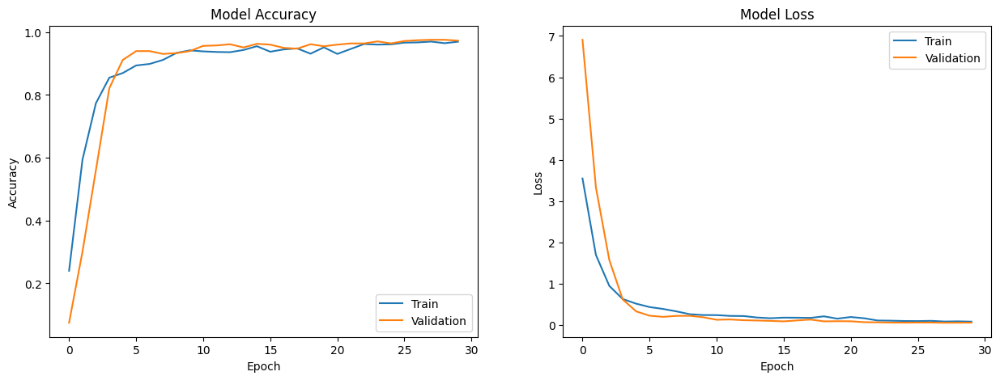
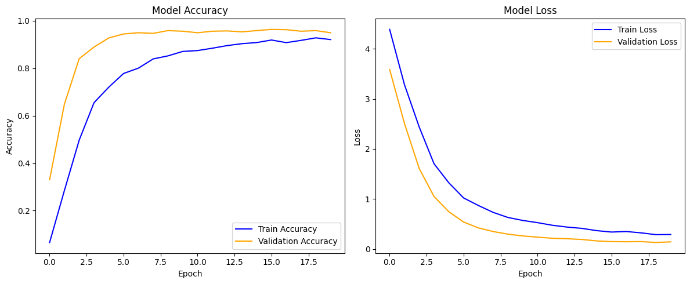

# Egyptian Hieroglyphs Classification

This project classifies Egyptian Hieroglyph symbols using deep learning. It leverages pre-trained models such as **MobileNetV2**, **VGG16**, and custom **CNNs** for efficient and accurate recognition.

## Dataset
The dataset used is available on Kaggle:  
[**Egyptian Hieroglyphs Dataset**](https://www.kaggle.com/datasets/alexandrepetit881234/egyptian-hieroglyphs)

- **Classes**: 92  
- **Split**: Evenly distributed between training and test sets  

## Training Details
- **Epochs**: 20  
- **Models Used**: CNN, **VGG16**, **MobileNetV2**

## Model Performance
- **MobileNetV2** and **VGG16** deliver the best performance, with high accuracy and precision (around 98%).
- **Custom CNNs** have lower accuracy (~21%) and require further optimization to match the pre-trained models.
- VGG16
  
- MobileNetV2
  

## Key Features
- Utilizes **MobileNetV2**, **VGG16**, and custom CNNs.
- Employs **transfer learning** for enhanced accuracy.
- Provides a scalable solution for hieroglyph recognition.

